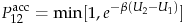
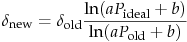
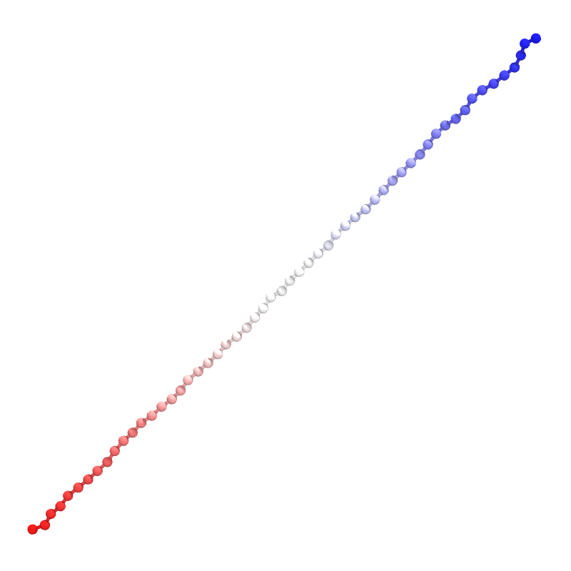
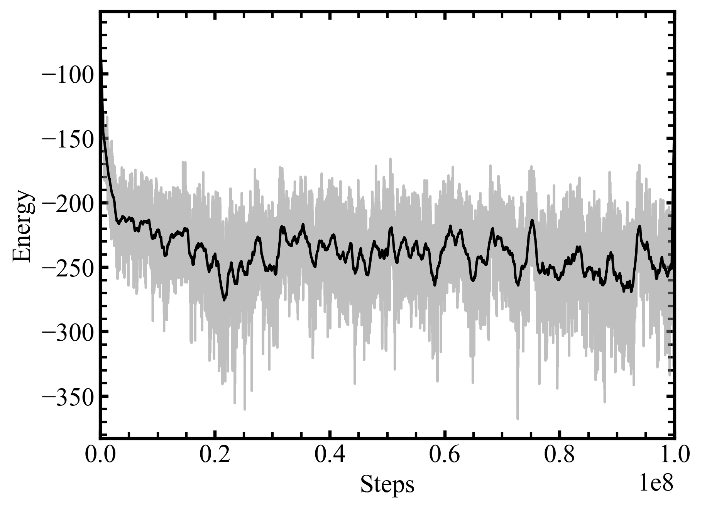
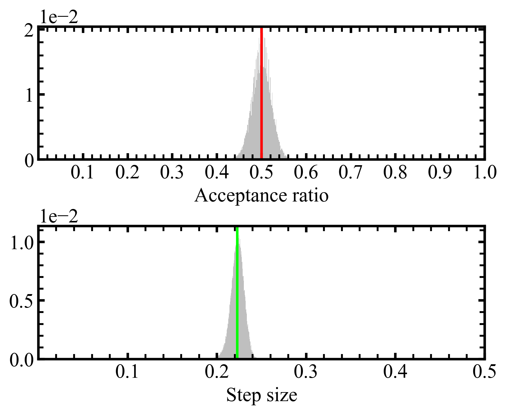

# EZ-MC
Quick and easy Monte Carlo simulations

### Metropolis Criterion Monte Carlo
The acceptance criterion are determined with Metropolis Criterion[1]:




The step size (`nsize`) will be updated adaptively (controlled by `fsize` and `idacc`) if not specified according to ref[2]:



*Notes*:
1. This program is heuristic - it only gives an easy demonstration with Monte Carlo simulation and might be adapted for interaction energy parameterization.
2. Pairwise interaction[3] were used for energy calculation, which has been suggested nonideal for current application[4].
3. Advanced application of the pairwise potential has been reported elsewhere[5].

### Usage and example
1. Build the program with `make` command in the root directory.
2. Once done, the executable (`ez-mc`) can be found in the `bin` folder. 
3. run with `./ez-mc config.cfg`, where an example input file with a protein G (PDB: 1PGB) is given below:
```
# MC steps (int)
nstep       100000000

# MC step size (float)
# if this is specified, [fsize] and [idacc], 
# which are used to calcualte step size 
# adaptively, will be igored
# nsize       1.0

# frequency to update step size (int)
fsize       1000

# ideal acceptance ratio (float)
idacc       0.5

# freqeuncy to save coordinates (int)
fsavc       1000

# freqeuncy to write log file (int)
fsavl       1000

# Input fasta sequence file (str)
fasta       1pgb.fasta

# Output file names (str)
logname     1pgb.log
psfname     1pgb.psf
dcdname     1pgb.dcd
```

Below is a short demo, where the peptide was initially built along X-axis then equilibrated after 100M steps:



The system is gradually relaxed when examining the time evolution of energy:



As expected, the acceptance ratio is populated with an average value of `0.49998`, while the values of adaptive step size are fluctuating around `0.22275`.



### Reference
[1] https://sites.engineering.ucsb.edu/~shell/che210d/Monte_Carlo.pdf

[2] Swendsen, Robert H. "How the maximum step size in Monte Carlo simulations should be adjusted." Physics Procedia 15 (2011): 81-86.

[3] Miyazawa, Sanzo, and Robert L. Jernigan. "Estimation of effective interresidue contact energies from protein crystal structures: quasi-chemical approximation." Macromolecules 18.3 (1985): 534-552.

[4] Vendruscolo, Michele, and Eytan Domany. "Pairwise contact potentials are unsuitable for protein folding." The Journal of chemical physics 109.24 (1998): 11101-11108.

[5] Leonhard, K., J. M. Prausnitz, and C. J. Radke. "3D-lattice Monte Carlo simulations of model proteins. Size effects on folding thermodynamics and kinetics." Biophysical chemistry 106.1 (2003): 81-89.