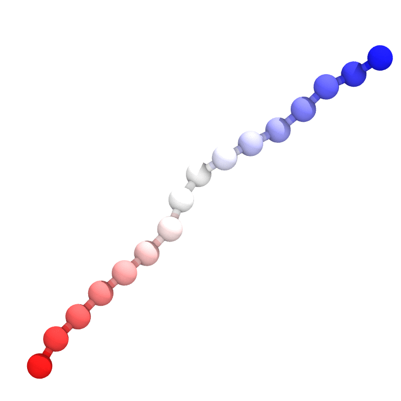

# ez-mc
Quick and easy Monte Carlo simulations

## Metropolis Criterion Monte Carlo
The acceptance criterion are determined with Metropolis Criterion:


The step size (`nsize`) will be updated adaptively (controlled by `fsize` and `idacc`) if not specified according to ref[1]:


*Notes*:
1. This program is heuristic - it only gives an easy demonstration with Monte Carlo simulation and might be adapted for interaction energy parameterization.
2. Pair-wise interaction[2] were used for energy calculation, which might not be ideal for current application[3].

## Usage and example
1. Build the program with `make` command in the root directory.
2. Once done, the executable (`ez-mc`) can be found in the `bin` folder. 
3. run with `./ez-mc config.cfg`, where an example input file with a beta-hairpin sequence[4] is given below:
```
# MC steps (int)
nstep       100000

# MC step size (float)
# if this is specified, [fsize] and [idacc], which are used to calcualte 
# step size adaptively, will be igored
# nsize       1.0

# frequency to update step size (int)
fsize       1000

# ideal acceptance ratio (float)
idacc       0.5

# freqeuncy to save coordinates (int)
fsavc       1000

# freqeuncy to write log file (int)
fsavl       1000

# Input fasta sequence file (str)
fasta       beta.fasta

# Output file names (str)
logname     beta.log
psfname     beta.psf
dcdname     beta.dcd
```

The fasta file for the beta-hairpin is 
```
>BETA HAIRPIN SEQUENCE FROM DINNER, ARON R. ET AL (1999)
GEWTYDDATKTFTVTE
```

Below is a short demo, where the peptide was initially built along X-axis then equilibrated after one million steps:



## Reference
[1] Swendsen, Robert H. "How the maximum step size in Monte Carlo simulations should be adjusted." Physics Procedia 15 (2011): 81-86.

[2] Miyazawa, Sanzo, and Robert L. Jernigan. "Estimation of effective interresidue contact energies from protein crystal structures: quasi-chemical approximation." Macromolecules 18.3 (1985): 534-552.

[3] Vendruscolo, Michele, and Eytan Domany. "Pairwise contact potentials are unsuitable for protein folding." The Journal of chemical physics 109.24 (1998): 11101-11108.

[4] Dinner, Aaron R., Themis Lazaridis, and Martin Karplus. "Understanding β-hairpin formation." Proceedings of the National Academy of Sciences 96.16 (1999): 9068-9073.